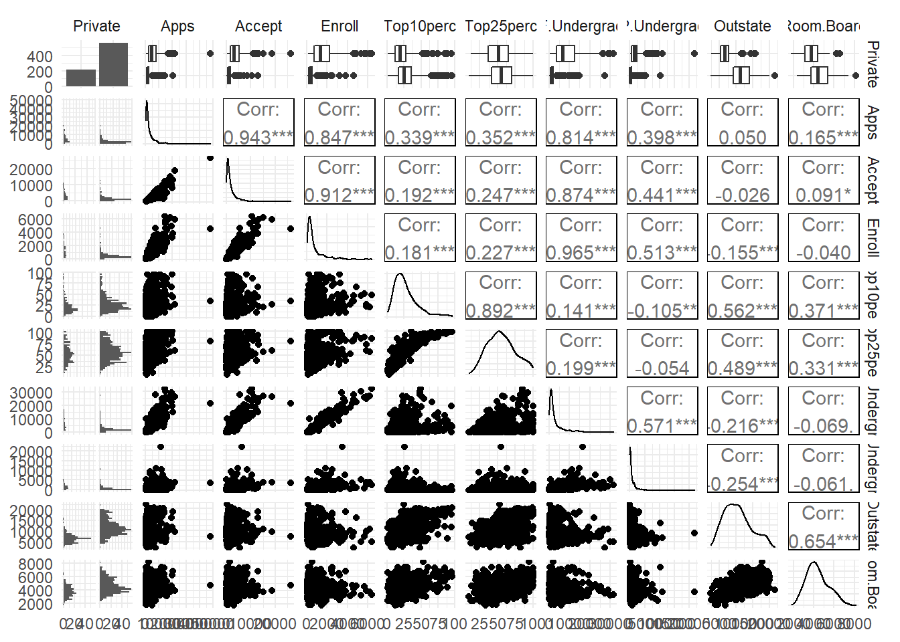
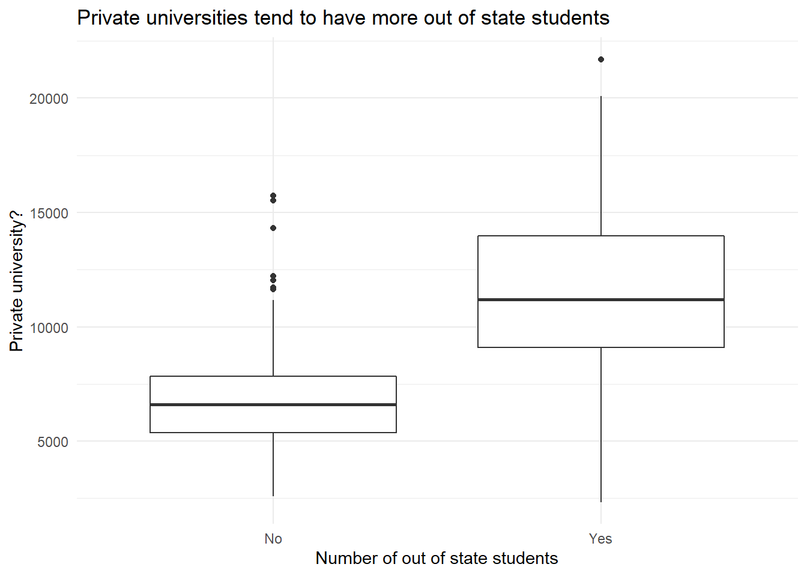
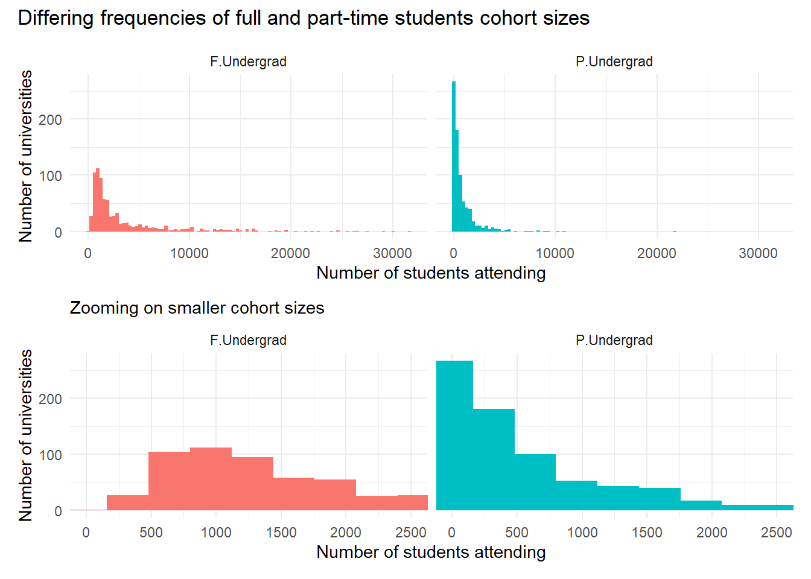
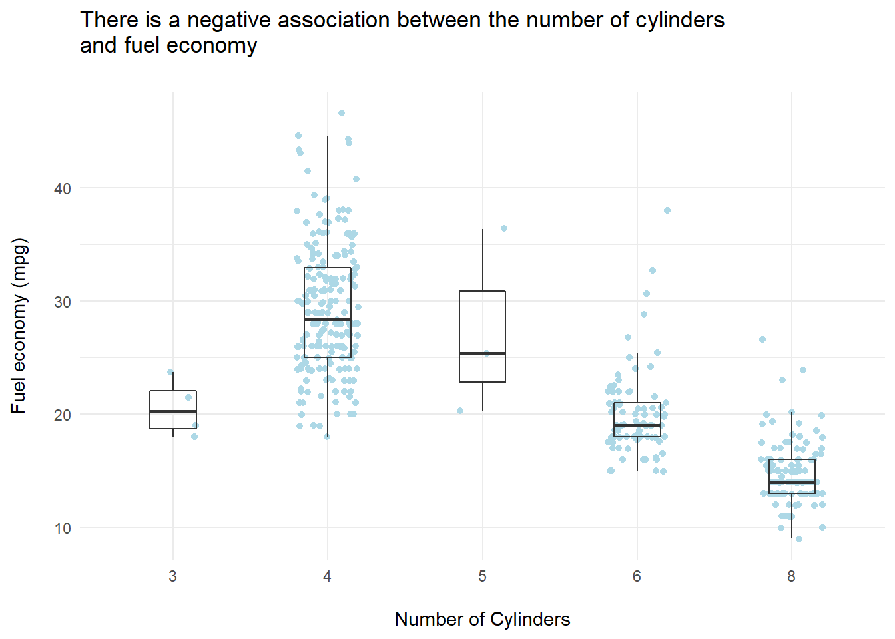
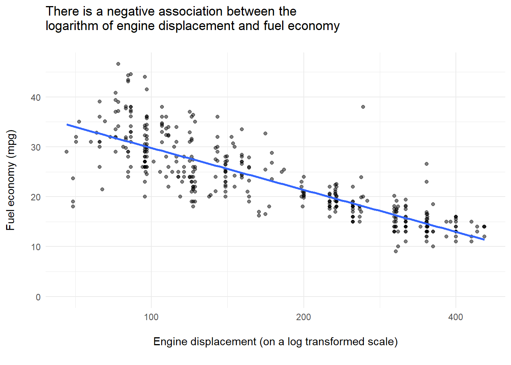
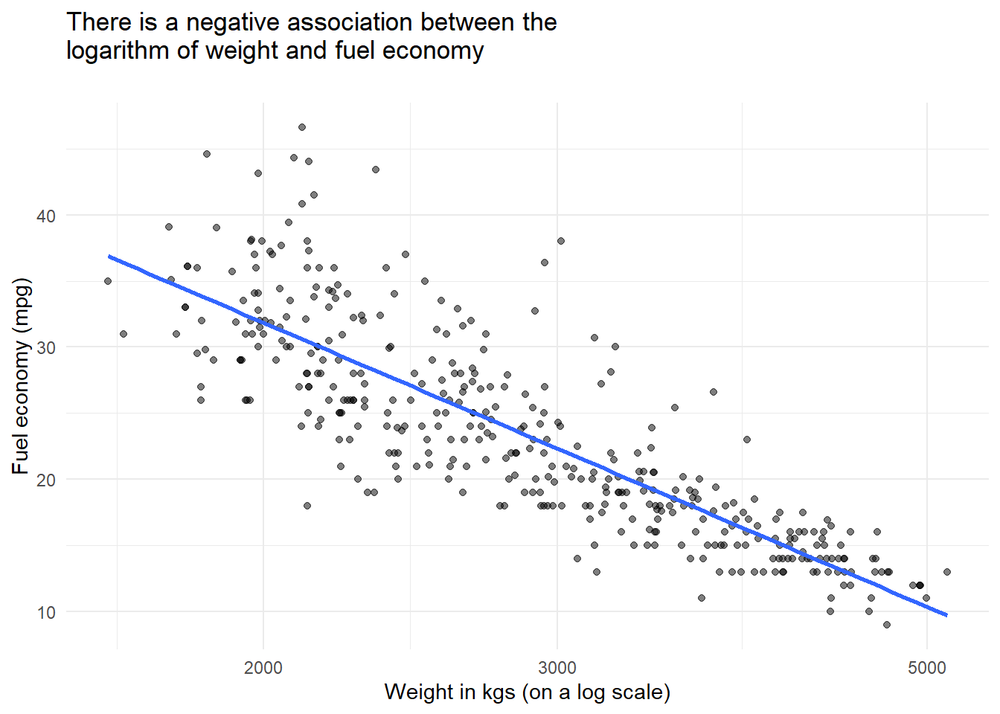

# Statistical Learning


```r
library(tidyverse)
```

```
## Warning: package 'tidyverse' was built under R version 4.0.5
```

```
## -- Attaching packages --------------------------------------- tidyverse 1.3.1 --
```

```
## v ggplot2 3.3.3     v purrr   0.3.4
## v tibble  3.1.0     v dplyr   1.0.5
## v tidyr   1.1.3     v stringr 1.4.0
## v readr   1.4.0     v forcats 0.5.1
```

```
## Warning: package 'ggplot2' was built under R version 4.0.4
```

```
## Warning: package 'tibble' was built under R version 4.0.5
```

```
## Warning: package 'tidyr' was built under R version 4.0.4
```

```
## Warning: package 'dplyr' was built under R version 4.0.4
```

```
## Warning: package 'forcats' was built under R version 4.0.4
```

```
## -- Conflicts ------------------------------------------ tidyverse_conflicts() --
## x dplyr::filter() masks stats::filter()
## x dplyr::lag()    masks stats::lag()
```


## Conceptual Exercises

**Question 1: Flexible and inflexible statistical learning methods.**

*(a):* If sample size (n) is very large and the number of predictors is small (p) I would expect a flexible statistical learning method to perform better than an inflexible method. This is where sample sizes are large one can assume that the variance will be a lesser contributor to the irreducible error than bias. And, the bias of the more flexible method will be lower than the bias of the more flexible method.

*(b):* If there is a large number of predictors (p) and a small number of data points (n) I would expect a flexible statistical learning method to perform worse than an inflexible method. This is because a flexible method would be likely to have high variance (i.e. the component of the reducible error associated with the differences between model prediction over different training sets). Hence, the more flexible method would be more prone to overfitting the small number of training data points (than the inflexible method) and in turn be likely to return worse results. This is of course a generalisation and the performance of flexible vs. inflexible methods varies from dataset to dataset.

*(c):* If the relationship between the response variable and the predictor variables is highly non linear I would expect a flexible statistical learning method to perform better than an inflexible method. This is because a relatively inflexible methods (such as linear regression) tend to have assumptions around linearity embedded within them, whereas more flexible methods do not (e.g. splines).

*(d):* If the variance of the error terms is extremely high I would expect a flexible statistical learning method to perform worse than an inflexible method. This is because with a flexible model there would a tendency to overfit the large amount noise (i.e. very high variance in error terms) in the data. Whereas, the less flexible method would be less sensitive to the noise and in many cases could well do a better job of extracting the signal (i.e. relationship) between the predictors and the response variable.

**Question 2: Regression or classification problems.**

*(a):*

-   Problem type: regression (salary is a continuous variable);

-   n = 500;

-   and, p = 3.

*(b):*

-   Problem type: classification (success or failure is a binary variable);

-   n = 20;

-   and, p = 13.

*(c):*

-   Problem type - regression (% change is a continuous variable);

-   n = 52;

-   and, p = 3.

**Question 3: Bias-variance decomposition**

*(a):* sketched in paper notebook.

*(b):* describing the shape of typical error curves

-   Bias (squared) - reduces as the flexibility of method increases because the bias represents the errors by approximating and simplifying a real world system. Less flexible methods apply more simplifications than flexible methods and hence have greater bias.

-   Variance - increase as the flexibility of a method increases because the variance represents the error arising from sample process. More flexible methods are more closely fitted to the specific features of the data than less flexible models. So, overfitting of the current sample increases of model flexibility, driving increases in variance errors.

-   The Training error - decrease as the flexibility of a method increases (following the bias curve plus the irreducible error). This is because variance errors are not evident in fitting to the training set, rather overfitting actually reduce training errors (giving an overly optimistic perspective on the likely performance of a method on new data).

-   The test error - decreases as method flexibility increases but then increases again. This is because although the test error decrease as the bias component of the errors decreases, at some point increases in the variance component of the error drives increases in the test error. In other words there is a point at which the advantages of increase flexibility (in terms of reducing the bias component) are outweigh by the disadvantages (in terms of overfitting as the variance component increases.

-   The irreducible error - is constant and by definition is the component of the error that is unaffected by method choice and parameterisation.

**Question 4: Examples problems which are well suited to statistical learning methods.**

Classification problems:

-   Identifying if an email is or is not spam is a problem where predictions are required. The response variable would be flag indicating if an email is spam or not (in the training set this might have been set by manually reviewing the email). The predictor variables would be characteristics of the email for example the use of certain words that are prevalent in spam.

-   Explaining difference in the proportion of professors who have tenured. The response variable would be a variable indicating if the professor in question has tenure. The explanatory variables could be characteristic including the gender of the professor, if they have a minority ethnic background etc.

-   Predicting if an athlete will win a medal (or not) at the Olympics in a specific event. Predictor variables here could include for example performance at past Olympics, personal bests etc.

Regression problems:

-   Estimating the amount of plastic waste produced by a country. Here predictor variables could include GDP, population, quantitative measure of the maturity of the waste disposal system etc.

-   Predicting if a given individual will make use of green spaces in their local area. Here predictor variables might include self-reported health status, age etc.

-   Explaining the Green House Gas emission reductions (or increases) delivered by a country. Here predictor values might include GDP per capita, a categorical variable indicating how supportive a countries is at COP meetings, the political leanings of the governing party (on a left-right axis) etc.

Clustering problems:

-   Identifying if there are groups of neighborhoods within a city facing similar problems with citizens accessing green space. Here features for clustering might include the proportion of the population within easy walking distance of public green space, the amount of public green space in the neighborhood, the proportion of the population experiencing disabilities.

-   Identifying if there are groups of customer (of a given business) with similar purchasing habit. Here feature for clustering might total spend per month with the business, the frequency of purchases etc.

-   Identify if groups of people with similar attitudes to car sharing can be identified from survey responses. Here features for clustering might include Likhert scales responses asking about attitudes to car sharing.

**Question 5: advantages and disadvantages of a very flexible method (relative to an inflexible method).**

*Advantages:*

-   ability to capture non-linear relationships between variables;

-   ability to pick up relatively subtle associations between variables;

-   can deliver more accurate prediction by modeling more of the complexity of real world systems.

*Disadvantages:*

-   prone to overfitting;

-   large numbers of data points are required;

-   computational intensive;

-   can be difficult to interpret the model, and hence not so useful for inference.

**Question 6: parametric and non-parametric methods**

A parametric model makes as assumptions about the functional form (i.e. shape) of *f.* Where *f* is the function mapping the values of predictor/s to the values of the response variable. Based on these assumptions the general form of the model can be mathematical expressed including the predictor variables and associated co-efficients. Once a parametric model has been selected it can be fit to the data, this reduces to a problem of estimating the coefficients in the mathematical model. The primary advantage of this approach is its simplicity (estimating a set of parameters is much simpler than estimating f itself). The disadvantages are that: it can be difficult to know which model (i.e. shape) to select and picking the wrong model results in poor results; and, that flexible models are prone to overfitting.

A non-parametric model does not make any assumptions about the functional form of *f.* Rather such models attempt to estimate *f* by fitting the points as closely as possible, subject to specified constraints on how 'wiggly' or smooth a line should result. The main advantage of non-parametric models is that they can fit a wide variety of shapes for *f* and the analyst does not need to make any *a priori* guesses about what the associated between predictor and response variables are. However, this advantage comes at the cost of complexity. As the problems of estimating *f* is not reduced to one of estimating parameters, very large numbers of data points are needed. Also, given non-parametric models are not constrained by assumption about the shape of *f* then care is needed to avoid overfitting (i.e. an appropriate smoothness constraint must be defined by the analyst).

**Question 7: K-nearest neighbors**

*(a):* the euclidean distance between each data point and a test point (x~1~ = x~2~ = x~3~ = 0) is shown below.


```r
library(tidyverse)

data <- read_csv("2_7.csv") %>% 
  mutate(dist_from_test_point = sqrt(x1^2 + x2^2 + x3^2))

data %>% 
  knitr::kable()
```


| obs| x1| x2| x3|y     | dist_from_test_point|
|---:|--:|--:|--:|:-----|--------------------:|
|   1|  0|  3|  0|Red   |             3.000000|
|   2|  2|  0|  0|Red   |             2.000000|
|   3|  0|  1|  3|Red   |             3.162278|
|   4|  0|  1|  2|Green |             2.236068|
|   5| -1|  0|  1|Green |             1.414214|
|   6|  1|  1|  1|Red   |             1.732051|

```r
data %>% 
  select(obs, dist_from_test_point) %>% 
  knitr::kable()
```


| obs| dist_from_test_point|
|---:|--------------------:|
|   1|             3.000000|
|   2|             2.000000|
|   3|             3.162278|
|   4|             2.236068|
|   5|             1.414214|
|   6|             1.732051|

*(b):* Using the k-nearest neighbor method with k = 1 for the test point (x~1~ = x~2~ = x~3~ = 0) the prediction would be the Y value of the nearest point. The nearest point is 5 so the prediction would be `Green`.

*(c):* If k =3, k-nearest neighbor would look at the three nearest points (y~2~ = `Red`, y~5~ = `Green` and y~6~ = `Red`). The predicted y value would be `Red` as the majority of the k nearest points have an observed y values of `Red`.

## Applied Exercises

**Question 8: The Colleges Dataset**

*(a):* first I read in the data for the package.


```r
library(ISLR)
library(pander)
college <- as_tibble(College)
```

*(b):* There college names are already stored as row names


```r
pander(head(college))
```


------------------------------------------------------------------------
 Private   Apps   Accept   Enroll   Top10perc   Top25perc   F.Undergrad 
--------- ------ -------- -------- ----------- ----------- -------------
   Yes     1660    1232     721        23          52          2885     

   Yes     2186    1924     512        16          29          2683     

   Yes     1428    1097     336        22          50          1036     

   Yes     417     349      137        60          89           510     

   Yes     193     146       55        16          44           249     

   Yes     587     479      158        38          62           678     
------------------------------------------------------------------------

Table: Table continues below

 
-------------------------------------------------------------------------
 P.Undergrad   Outstate   Room.Board   Books   Personal   PhD   Terminal 
------------- ---------- ------------ ------- ---------- ----- ----------
     537         7440        3300       450      2200     70       78    

    1227        12280        6450       750      1500     29       30    

     99         11250        3750       400      1165     53       66    

     63         12960        5450       450      875      92       97    

     869         7560        4120       800      1500     76       72    

     41         13500        3335       500      675      67       73    
-------------------------------------------------------------------------

Table: Table continues below

 
----------------------------------------------
 S.F.Ratio   perc.alumni   Expend   Grad.Rate 
----------- ------------- -------- -----------
   18.1          12         7041       60     

   12.2          16        10527       56     

   12.9          30         8735       54     

    7.7          37        19016       59     

   11.9           2        10922       15     

    9.4          11         9727       55     
----------------------------------------------

*(c):* First I produce the summary statistics.


```r
college %>% 
  skimr::skim()
```


**Variable type: factor**

|skim_variable | n_missing| complete_rate|ordered | n_unique|top_counts        |
|:-------------|---------:|-------------:|:-------|--------:|:-----------------|
|Private       |         0|             1|FALSE   |        2|Yes: 565, No: 212 |


**Variable type: numeric**

|skim_variable | n_missing| complete_rate|     mean|      sd|     p0|    p25|    p50|     p75|    p100|hist                                     |
|:-------------|---------:|-------------:|--------:|-------:|------:|------:|------:|-------:|-------:|:----------------------------------------|
|Apps          |         0|             1|  3001.64| 3870.20|   81.0|  776.0| 1558.0|  3624.0| 48094.0|▇▁▁▁▁ |
|Accept        |         0|             1|  2018.80| 2451.11|   72.0|  604.0| 1110.0|  2424.0| 26330.0|▇▁▁▁▁ |
|Enroll        |         0|             1|   779.97|  929.18|   35.0|  242.0|  434.0|   902.0|  6392.0|▇▁▁▁▁ |
|Top10perc     |         0|             1|    27.56|   17.64|    1.0|   15.0|   23.0|    35.0|    96.0|▇▇▂▁▁ |
|Top25perc     |         0|             1|    55.80|   19.80|    9.0|   41.0|   54.0|    69.0|   100.0|▂▆▇▅▃ |
|F.Undergrad   |         0|             1|  3699.91| 4850.42|  139.0|  992.0| 1707.0|  4005.0| 31643.0|▇▁▁▁▁ |
|P.Undergrad   |         0|             1|   855.30| 1522.43|    1.0|   95.0|  353.0|   967.0| 21836.0|▇▁▁▁▁ |
|Outstate      |         0|             1| 10440.67| 4023.02| 2340.0| 7320.0| 9990.0| 12925.0| 21700.0|▃▇▆▂▂ |
|Room.Board    |         0|             1|  4357.53| 1096.70| 1780.0| 3597.0| 4200.0|  5050.0|  8124.0|▂▇▆▂▁ |
|Books         |         0|             1|   549.38|  165.11|   96.0|  470.0|  500.0|   600.0|  2340.0|▇▆▁▁▁ |
|Personal      |         0|             1|  1340.64|  677.07|  250.0|  850.0| 1200.0|  1700.0|  6800.0|▇▃▁▁▁ |
|PhD           |         0|             1|    72.66|   16.33|    8.0|   62.0|   75.0|    85.0|   103.0|▁▁▅▇▅ |
|Terminal      |         0|             1|    79.70|   14.72|   24.0|   71.0|   82.0|    92.0|   100.0|▁▁▃▆▇ |
|S.F.Ratio     |         0|             1|    14.09|    3.96|    2.5|   11.5|   13.6|    16.5|    39.8|▁▇▂▁▁ |
|perc.alumni   |         0|             1|    22.74|   12.39|    0.0|   13.0|   21.0|    31.0|    64.0|▅▇▆▂▁ |
|Expend        |         0|             1|  9660.17| 5221.77| 3186.0| 6751.0| 8377.0| 10830.0| 56233.0|▇▁▁▁▁ |
|Grad.Rate     |         0|             1|    65.46|   17.18|   10.0|   53.0|   65.0|    78.0|   118.0|▁▅▇▅▁ |

Then produce a scatter plot matrix for the first 10 variables.



*(c):* next is to plot side by side boxplots of `outstate` vs `private`


```r
college %>% 
  ggplot(aes(x = Outstate, y = Private)) +
  geom_boxplot() +
  coord_flip() +
  
  labs(x = "Private university?",
       y = "Number of out of state students",
       title = "Private universities tend to have more out of state students")
```



*(iv):* next is looking at universities with high proportions of students from elite high schools.


```r
college %>% 
  mutate(elite = if_else(Top10perc > 50,
                         TRUE,
                         FALSE)) %>% 
  group_by(elite) %>% 
  summarise(n = n())
```

```
## # A tibble: 2 x 2
##   elite     n
##   <lgl> <int>
## 1 FALSE   699
## 2 TRUE     78
```

*(v):* next looking at producing some histograms for a couple of continuous variables of interest (full and part time undergraduates)


```r
library(patchwork)

p <- college %>% 
  select(F.Undergrad, P.Undergrad) %>% 
  mutate(id = row_number(), .before = F.Undergrad) %>% 
  pivot_longer(cols = c(F.Undergrad, P.Undergrad), 
               names_to = "student_status", 
               values_to = "number_of_students") %>% 
  
  ggplot(aes(number_of_students)) +
  geom_histogram(aes(fill = student_status), bins = 100) +
  facet_wrap(~student_status) +
  guides(fill = FALSE) +
  labs(x = "Number of students attending",
       y = "Number of universities")

p_zoom <- p + coord_cartesian(xlim = c(0,2500)) +
  labs(subtitle = "Zooming on smaller cohort sizes")

p / p_zoom +
  plot_annotation(title = "Differing frequencies of full and part-time students cohort sizes")
```



*(vi):* Continuing the exploratory data analysis, my key findings were as follows:

-   Private universities appear to have higher graduation rates than public universities.


```r
college %>% 
  
  # remove an outlier with impossible graduation rate
  filter(Grad.Rate <= 100) %>%
  
  # produce plot base
  ggplot(aes(Private, Grad.Rate)) +
  
  # add data points as background layer
  geom_jitter(alpha = 0.5, width = 0.2, colour = "lightblue") +
  geom_boxplot(fill = NA, outlier.shape = NA,
               size = 1) +
  
  # add labels
  labs(x = "Private university?",
       y = "Graduation rate",
       title = "Private universities appear to have higher graduation rates\n")
```


-   More selective universities appear to have higher graduation rates.


```r
college %>% 
  
  # remove an outlier with impossible graduation rate
  filter(Grad.Rate <= 100) %>%
  
  # create plot base
  ggplot(aes(cut_width(Accept / Apps * 100, 
                       width = 20,
                       boundary = 0), Grad.Rate)) +
  
  # add data points as a background layer
  geom_jitter(alpha = 0.5, colour = "lightblue", width = 0.2)+
  
  # add boxplots
  geom_boxplot(width = 0.2, alpha = 0) +
  
  # format scales for readability
  scale_x_discrete(labels = c("0-19%", "20-39%", "40-59%", "60-79%", "80-100%")) +
  scale_y_continuous(labels = scales::percent_format(scale = 1)) +
  
  # add labels
  labs(x = "\nPercentage of applications accepted",
       y = "Percentage of students graduating\n",
       title = "More selective universities appear to have higher graduation rates\n")
```


**Question 9: The Auto dataset**

*(a):*

-   Quantitative predictors: `mpg`, `cylinders`, `displacement`, `horsepower`, `weight`, `acceleration`, `year` and `origin`.

-   Qualitative predictor: `name.`

*(b):* The range for each quantiative variable is shown in the skim dataframe below (p0 corresponds to the minimum and p100 corresponds to the maximum).

*(c):* The mean and standard deviations for each quantiative variable is shown in the skim dataframe below.


```r
skimr::skim(Auto) %>% 
  select(-n_missing, -complete_rate)
```


**Variable type: factor**

|skim_variable |ordered | n_unique|top_counts                     |
|:-------------|:-------|--------:|:------------------------------|
|name          |FALSE   |      301|amc: 5, for: 5, toy: 5, amc: 4 |


**Variable type: numeric**

|skim_variable |    mean|     sd|   p0|     p25|     p50|     p75|   p100|hist                                     |
|:-------------|-------:|------:|----:|-------:|-------:|-------:|------:|:----------------------------------------|
|mpg           |   23.45|   7.81|    9|   17.00|   22.75|   29.00|   46.6|▆▇▆▃▁ |
|cylinders     |    5.47|   1.71|    3|    4.00|    4.00|    8.00|    8.0|▇▁▃▁▅ |
|displacement  |  194.41| 104.64|   68|  105.00|  151.00|  275.75|  455.0|▇▂▂▃▁ |
|horsepower    |  104.47|  38.49|   46|   75.00|   93.50|  126.00|  230.0|▆▇▃▁▁ |
|weight        | 2977.58| 849.40| 1613| 2225.25| 2803.50| 3614.75| 5140.0|▇▇▅▅▂ |
|acceleration  |   15.54|   2.76|    8|   13.78|   15.50|   17.02|   24.8|▁▆▇▂▁ |
|year          |   75.98|   3.68|   70|   73.00|   76.00|   79.00|   82.0|▇▆▇▆▇ |
|origin        |    1.58|   0.81|    1|    1.00|    1.00|    2.00|    3.0|▇▁▂▁▂ |

*(d):* The means and standard deviations for the quantitative variables for the dataset (minus the 10th and 85th rows) are shown in the skim dataframe below.


```r
autos_omit <- slice(Auto, -10, -85)

skimr::skim(autos_omit) %>% 
  select(-n_missing, -complete_rate)
```


**Variable type: factor**

|skim_variable |ordered | n_unique|top_counts                     |
|:-------------|:-------|--------:|:------------------------------|
|name          |FALSE   |      299|amc: 5, for: 5, toy: 5, amc: 4 |


**Variable type: numeric**

|skim_variable |    mean|     sd|   p0|     p25|    p50|     p75|   p100|hist                                     |
|:-------------|-------:|------:|----:|-------:|------:|-------:|------:|:----------------------------------------|
|mpg           |   23.49|   7.80|    9|   17.50|   23.0|   29.00|   46.6|▆▇▆▃▁ |
|cylinders     |    5.46|   1.70|    3|    4.00|    4.0|    8.00|    8.0|▇▁▃▁▃ |
|displacement  |  193.51| 104.14|   68|  105.00|  148.5|  262.00|  455.0|▇▂▂▃▁ |
|horsepower    |  104.07|  38.18|   46|   75.00|   92.5|  125.00|  230.0|▆▇▃▁▁ |
|weight        | 2972.47| 848.51| 1613| 2223.75| 2797.5| 3608.00| 5140.0|▇▇▅▅▂ |
|acceleration  |   15.57|   2.74|    8|   13.83|   15.5|   17.08|   24.8|▁▆▇▂▁ |
|year          |   76.00|   3.68|   70|   73.00|   76.0|   79.00|   82.0|▇▆▇▆▇ |
|origin        |    1.58|   0.81|    1|    1.00|    1.0|    2.00|    3.0|▇▁▂▁▂ |

*(e and f):* The correlation plot below shows a high degree of correlation between four predictor variables (`cylinders`, `displacement`, `horsepower` and `weight`). There is also a high degree of correlation between these three predictors and the response variable (`mpg`).


```r
GGally::ggcorr(Auto, label = TRUE)
```


Scatter plots can help use look at these four predictor variables in more detail.


```r
ggplot(Auto,
       aes(factor(cylinders), mpg)) +
  geom_jitter(colour = "lightblue", width = 0.2) +
  geom_boxplot(width = 0.3, alpha = 0) +
  labs(x = "\nNumber of Cylinders",
       y = "Fuel economy (mpg)\n",
       title = "There is a negative association between the number of cylinders\nand fuel economy\n")
```




```r
ggplot(Auto,
       aes(displacement, mpg)) +
  geom_point(alpha = 0.5) +
  geom_smooth(method = "lm", se = FALSE) +
  scale_x_log10(breaks = c(0, 10, 100, 200, 400)) +
  expand_limits(x = 0, y = 0) +
  labs(x = "\nEngine displacement (on a log transformed scale)\n",
       y = "Fuel economy (mpg)\n",
       title = "There is a negative association between the\nlogarithm of engine displacement and fuel economy\n")
```




```r
ggplot(Auto,
       aes(horsepower, mpg)) +
  geom_point(alpha = 0.5) +
  geom_smooth(method = "lm", se = FALSE) +
  scale_x_log10() +
  expand_limits(x = 0, y = 0) +
  
  labs(x = "Horsepower (on a log scale)",
       y = "Fuel Economy (mpg)",
       title = "There is a negative association between the\nlogarithm of horsepower and fuel economy\n")
```


```r
ggplot(Auto,
       aes(weight, mpg)) +
  geom_point(alpha = 0.5) +
  geom_smooth(method = "lm", se = FALSE) +
  scale_x_log10() +
  labs(x = "Weight in kgs (on a log scale)",
       y = "Fuel economy (mpg)",
       title = "There is a negative association between the\nlogarithm of weight and fuel economy\n")
```



Each of the four variables plotted above could be useful predictors of fuel economy. Additionally, the correlation plot also identified two other variables with reasonably strong correlations with fuel economy: `year` and `origin`. If I was going to proceed to develop a model using this data, it would be worth looking at `year` and `origin` in more detail.

**Question 8: The Boston Housing dataset.**
